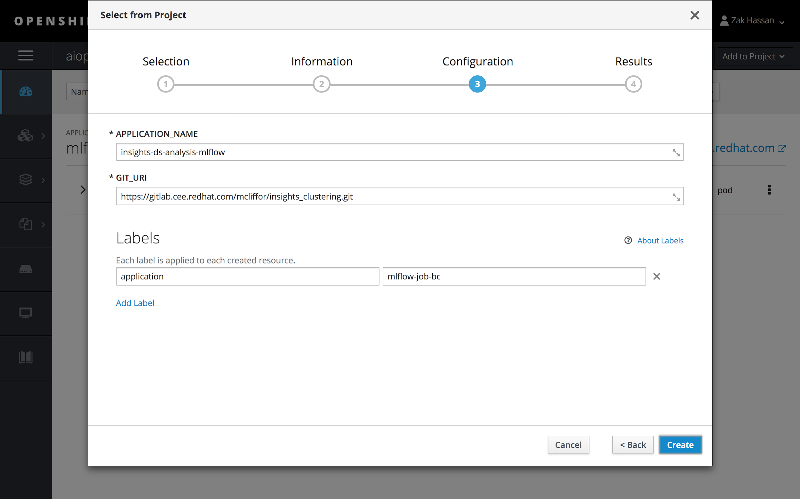
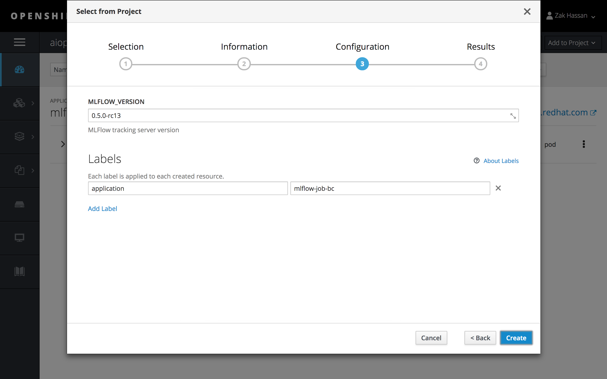
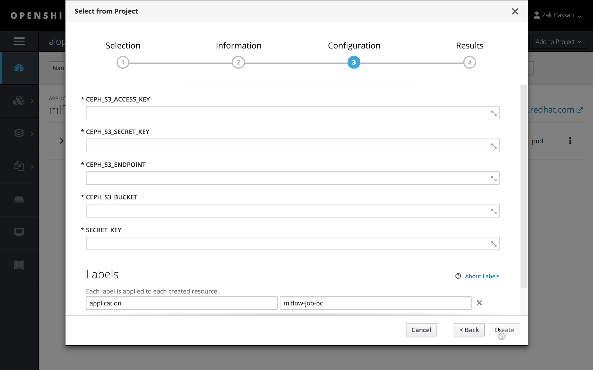
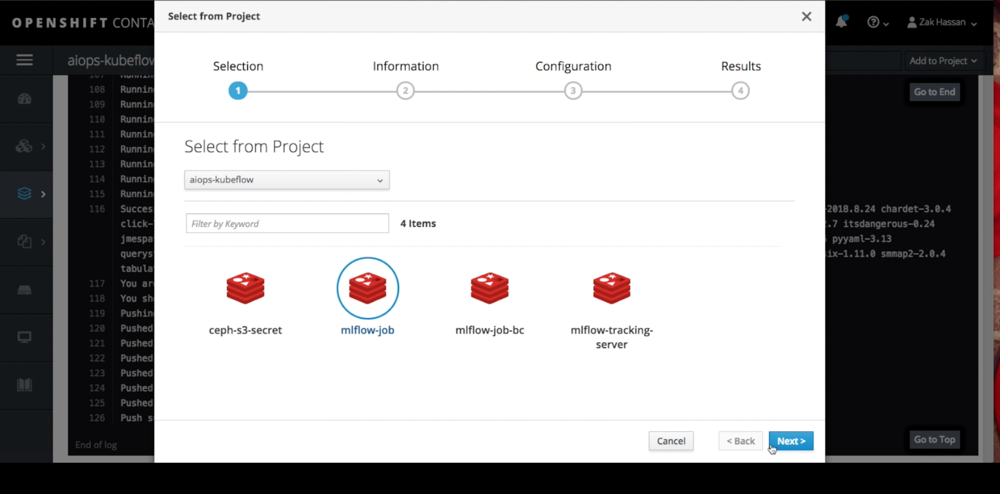
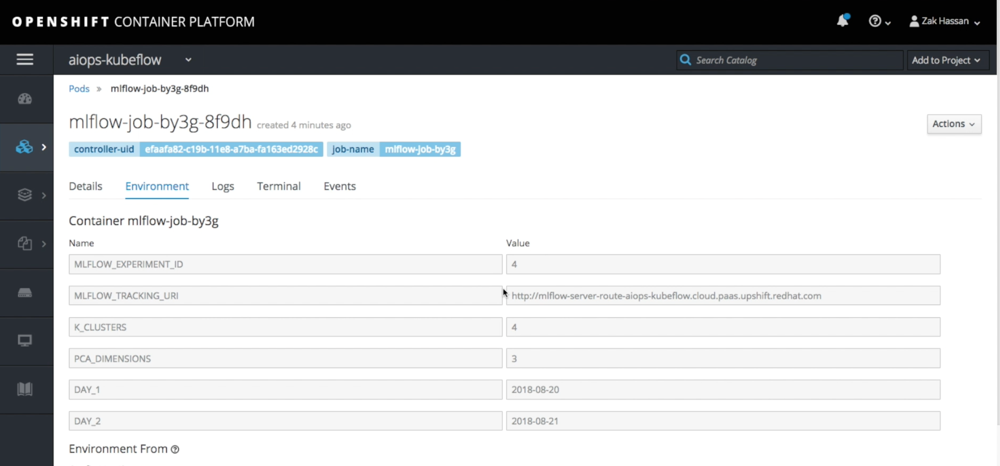

# Experiment Tracking

## Overview

In this repository we are providing our data scientists with tooling to perform hyper
parameter tuning with OpenShift. Our business requirement is to have the
ability to track parameters and metrics from their machine learning job
in OpenShift. We researched many tools but at this time the one that
fits our use case for experiment tracking is MLFlow. We will be using
the experiment tracking feature provided by MLFlow. We have ported
MLFlow to run on OpenShift and is now available for data scientists to
utilize.

 
The goal is for experiment tracking is to
allow our data scientists to test many parameters at scale using
OpenShift. We have provided templates to allow for this tooling to be
available for our data scientists on datahub. You can then compare
different runs of your machine learning job with different parameters
and choose the best parameters that yield the best metrics. See below
screenshot.

 

## Preparing Images With S2I 
 
To run your experiments you first need to get your code into docker
images and install the python dependencies. We have provided a template
and by exporting your jupyter notebook into a python file you can check
it into your github. Make sure to set the APP\_FILE to the name of the
file you exported. We have provided a template (mlflow-job-bc.yaml) to
make that process simple to set up.

 

## Installing Tracking Server
 
At the moment we have decided to go with a shared MLFlow tracking server
and each data scientist will have their own experiment sandbox (more on
this later on in this document). To install MLFlow tracking on openshift
we have a template you can utilize. In case you need to upgrade or want
to install your own instance of tracking then the following command
should allow for you to install mlflow in your namespace:

```bash
git clone https://github.com/AICoE/experiment-tracking.git
cd experiment-tracking
oc create -f mlflow-cf-server-template.yaml
```

Note: Once the tracking server is installed then you can select MLFlow
as you normally would anything in your openshift catalog. The template
has one parameter to pass in and that is the MLFLOW_VERSION which at
the time of this writing is ‘0.5.0-rc13’. You can look at the
***quay.io/zmhassan/mlflow*** for versions and select the appropriate
version you would like to deploy.

 

## Installing Ceph Secrets
 

We have provided a template to install your ceph s3 credentials into
your openshift environment as kubernetes secrets. After installing the
template you can simply just fill out the details and those values will
get injected into the running job as environment variables.

 

## Getting Started With MLFlow Jobs
 

****Prerequisite: You will need to install mlflow-tracking-server via
the template provided. You will also need to run the build config
(mlflow-job-bc) before running the job. You will also need to setup ceph
secret in case you would like to access ceph from your ML Job. We inject
the credentials via environment variables in the job run template.****

Once you have the build image we can then pass in different parameters
using template (mlflow-job.yaml). When doing hyper parameter tuning data
scientists can provide different parameters and then compare side by
side.

 

Replace git url with the following repo :
[*https://github.com/zmhassan/sample-mlflow-tracking-demo.git*](https://github.com/zmhassan/sample-mlflow-tracking-demo.git)
with your own github repo.

Also replace the following

-   environment variables:

    -   `MLFLOW_EXPERIMENT_ID`

    -   `APP_FILE`

-   Parameters to pass into your python program via environment
    > variables. For different runs `K_CLUSTERS=4` but you can change
    > that to a different input and see the resulting metrics.

 

## Jupyterhub Integration
 
My colleague Vaclav installed the mlflow dependencies into jupyter
notebook images in the datahub. By default, you will be able to utilize
the python api to work with the mlflow tracking server. All that is
required is importing mlflow and utilizing the python api.

 

There are some methods to know about such as the following:

  mlflow.[*log_param*](https://mlflow.org/docs/latest/python_api/mlflow.tracking.html#mlflow.tracking.MlflowClient.log_param)($1,$2)     Used to log parameter used to train model
  ----------------------------------------------------------------------------------------------------------------------------------------- -------------------------------------------------------------------------
  mlflow.[*log_metric*](https://mlflow.org/docs/latest/python_api/mlflow.tracking.html#mlflow.tracking.MlflowClient.log_metric)($1,$2)   Used to log metrics as a result of utilizing parameters to train model.

See mlflow documentation for additional details on python api for
different use cases:

[*https://www.mlflow.org/docs/latest/genindex.html*](https://www.mlflow.org/docs/latest/genindex.html)

## Experiment Isolation
 
Each data scientist may want to have some isolation when running
experiments and to achieve that you can utilize experiment id’s which
provide some isolation. We will work on a more robust solution but at
this time this solves our current problem. On the left side you will see
sandboxes.

 


To utilize for example zhassan **experiment_id** you would need to do
the following.

Set the environment variable in your notebook:
os.environ["MLFLOW_EXPERIMENT_ID"]='4'

***Note:*** If you would like to create additional experiment ids then
login into openshift and connect into the terminal for mlflow and run
the following command:

  --------------------------------------------------------------------------------------------
   
  --------------------------------------------------------------------------------------------

 

## Deleting Experiments
 
You can delete experiments by logging into the mlflow console and
changing directories to your
`/opt/app-root/src/mlruns/<experiment_id>`; which contains all
subfolders. Look for the folder with the run_id you wish to delete and
delete that folder. In the future we may prevent this and have automated
backups of experiments in s3.

## Connecting To Tracking Server:
 
When utilizing jupyter notebook you need to set the tracking server uri
either through environment variable or through code.

Choose one of the following options:

1)  Set the environment variable in your notebook:

   ```python
  
  os.environ["MLFLOW_TRACKING_URI"]='http://localhost:5000'

```

 
1)  Point your jupyter notebook to mlflow tracking server:

  ```python

  mlflow.set_tracking_uri("http://localhost:5000")
  
  ````
 
 

## Source 
 

To find the docker images source and example notebooks you can visit
gitlab at the following link.
[*https://github.com/AICoE/experiment-tracking.git*](https://github.com/AICoE/experiment-tracking.git)

See ‘**examples**’ folder for sample notebook which does training on
wine dataset.
